# Real-Time Rendering

Five self-contained real-time rendering experiments in **C++ / OpenGL 3.3 Core / GLSL**, each isolating one graphics topic into an interactive scene with runtime controls.

The goal was not to build a complete engine, but to implement each technique directly at the API and shader level — writing the BRDFs, the tangent-space construction, and the sampling comparisons by hand rather than relying on an engine's built-in materials.

| Lab | Branch | Topic | Key implementation |
|---|---|---|---|
| 1 | [`main`](https://github.com/Lara-Tiara/Real-time-Rendering/tree/main) | Lighting Models & PBR | Hand-written GGX / Smith / Schlick microfacet BRDF |
| 2 | [`Lab_2`](https://github.com/Lara-Tiara/Real-time-Rendering/tree/Lab_2) | Reflection, Refraction & Fresnel | F₀ derived from IOR; explicit total internal reflection handling |
| 3 | [`Lab_3`](https://github.com/Lara-Tiara/Real-time-Rendering/tree/Lab_3) | Normal & Bump Mapping | Gram-Schmidt orthogonalisation with handedness stored in tangent `.w` |
| 4 | [`Lab_4`](https://github.com/Lara-Tiara/Real-time-Rendering/tree/Lab_4) | Mipmapping & Filtering | Six minification filters compared under extreme UV tiling |
| 5 | [`Assignment5`](https://github.com/Lara-Tiara/Real-time-Rendering/tree/Assignment5) | Anisotropic Cloth | Three-way material comparison; sRGB/linear-correct texture pipeline |

> Each lab lives on its own branch because each is a standalone project with its own CMake configuration and asset set.

**Stack:** C++ · OpenGL 3.3 Core · GLSL · GLFW · GLAD · GLM · Assimp · Dear ImGui · stb_image · CMake

---

## Lab 1 — Lighting Models & PBR

**Branch:** [`main`](https://github.com/Lara-Tiara/Real-time-Rendering/tree/main)

Four identical meshes rendered side by side, each with a different reflectance model, so the differences are visible in a single frame under identical lighting.

<p align="center">
  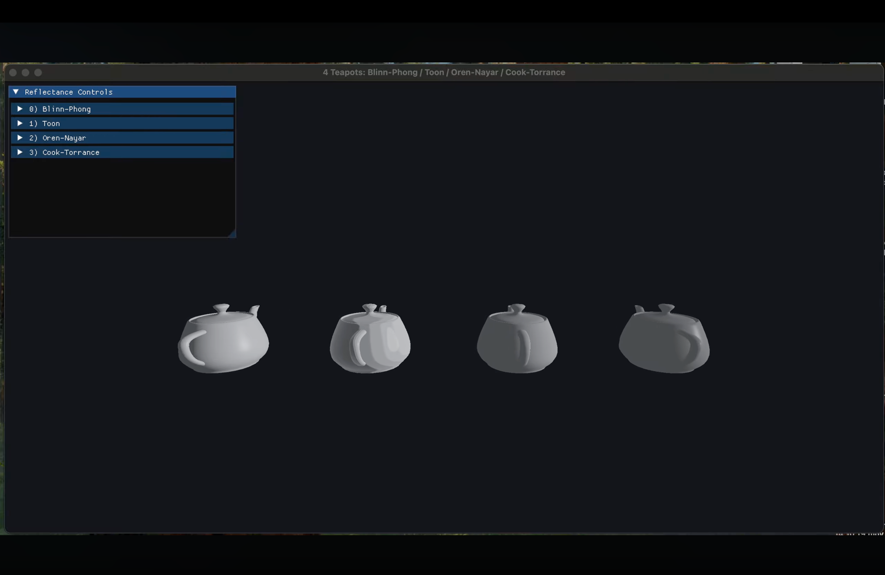
  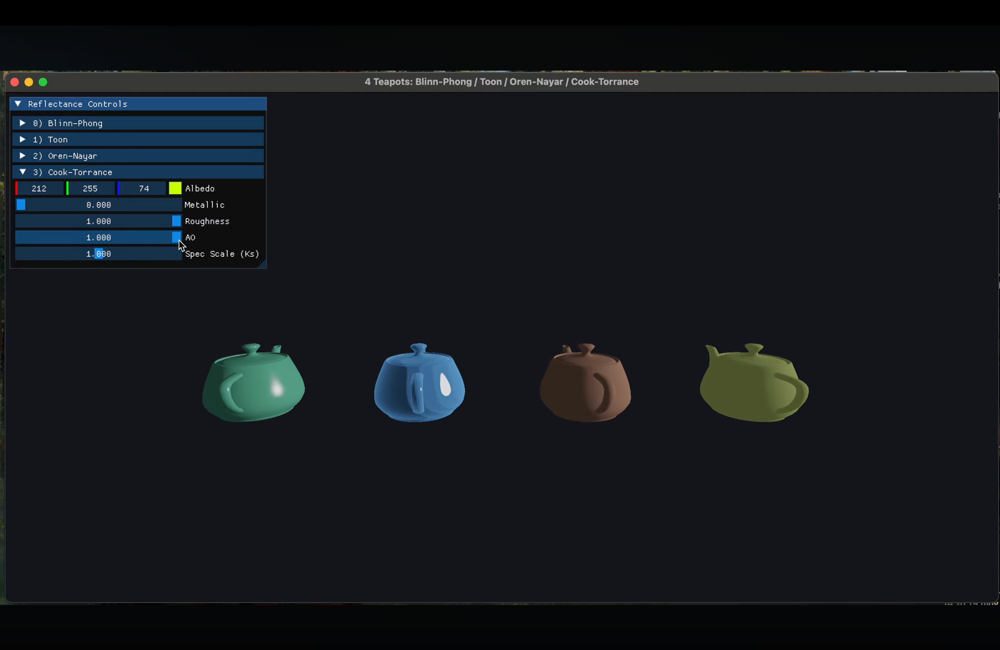
</p>

**Implementation notes**

- **Blinn-Phong** — half-vector specular, `pow(max(dot(N, H), 0), shininess)`. Cheaper than Phong's reflection vector and better behaved at grazing angles, at the cost of a different exponent scale.
- **Toon** — lighting quantised into discrete bands via `floor(NdotL * levels) / levels`, with `smoothstep` applied at band boundaries to avoid hard aliasing on the transitions. Rim lighting via `pow(1 - NdotV, 2)`.
- **Oren-Nayar** — qualitative model with the A/B terms driven by surface slope variance σ, plus the azimuthal correction term computed by projecting **L** and **V** onto the tangent plane. Degenerates to Lambert as σ → 0, which is how the implementation was verified.
- **Cook-Torrance** — full microfacet BRDF, `f = DFG / (4·NdotV·NdotL)`:
  - `D_GGX` — Trowbridge-Reitz normal distribution
  - `G_SmithGGX` — separable Smith geometry term with the Schlick-GGX approximation
  - `F_Schlick` — `F₀ + (1 - F₀)(1 - VdotH)⁵`
  - Diffuse/specular energy split via `kd = (1 - F)(1 - metallic)`, so metals lose their diffuse lobe entirely.
- Output passes through Reinhard tone mapping followed by gamma encoding.

**What the comparison shows** — the perceptual gap between the empirical models and the microfacet BRDF is largest at grazing angles and at high roughness, where Blinn-Phong's specular lobe keeps a fixed shape while GGX widens and dims correctly.

**Demo:** [YouTube](https://www.youtube.com/watch?v=SfaC5L3MMtU)

---

## Lab 2 — Reflection, Refraction & Fresnel

**Branch:** [`Lab_2`](https://github.com/Lara-Tiara/Real-time-Rendering/tree/Lab_2)

Transmissive dielectric materials rendered by sampling a cubemap along reflected and refracted directions.

<p align="center">
  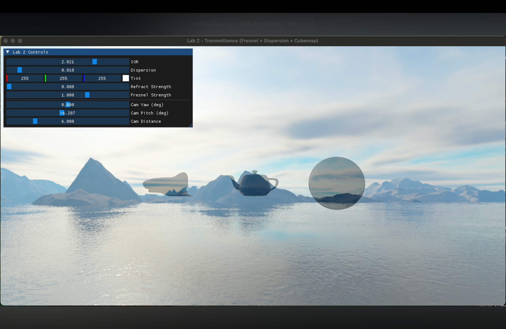
  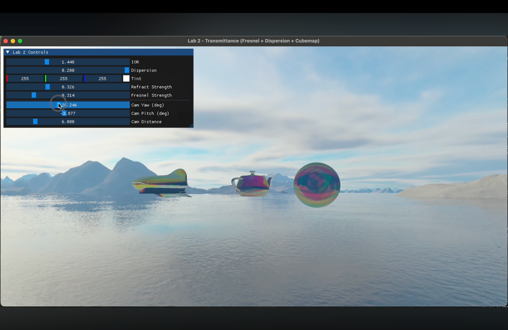
  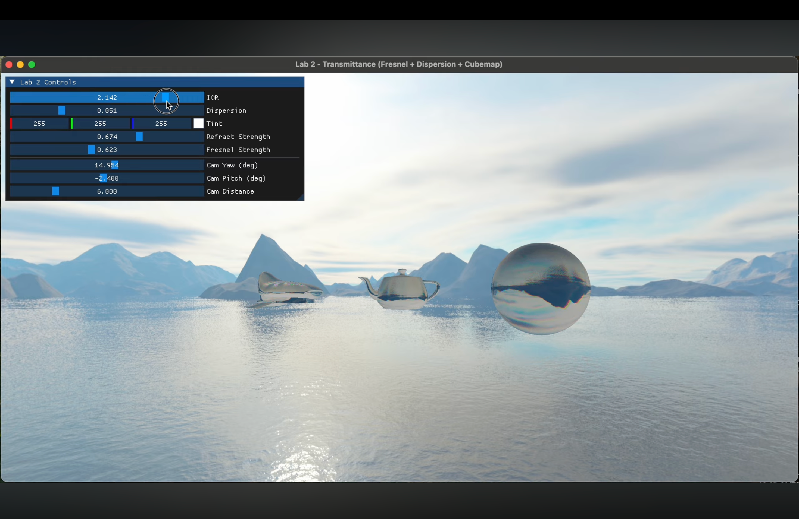
</p>

**Implementation notes**

- **Fresnel base reflectance derived from IOR** rather than hardcoded: `F₀ = ((n - 1)/(n + 1))²`, then Schlick's approximation for the view-dependent term. Glass at n = 1.5 gives F₀ ≈ 0.04.
- **Dispersion applied to the relative eta, not to the IOR directly.** Scaling `eta = 1/IOR` by `(1 ± dispersion)` per channel preserves the ratio between channels; offsetting the IOR itself distorts it disproportionately as IOR approaches 1.
- **Total internal reflection is handled explicitly.** GLSL's `refract()` returns a zero vector when the incident angle exceeds the critical angle; sampling a cubemap with that produces garbage. The shader tests the returned vector's length and falls back to the reflection direction.
- **Normals are flipped to face the viewer** (`if (dot(N, V) < 0) N = -N`) so back-facing and interior fragments refract correctly instead of producing black artefacts.
- **Environment samples are converted sRGB → linear before mixing.** Blending reflection and refraction in gamma space would give incorrect intensity ratios; the result is tone mapped and re-encoded at the end.

**What the experiment shows** — sweeping the camera makes the Fresnel behaviour of dielectrics obvious: the surface is dominated by refraction when viewed head-on and becomes almost purely reflective at grazing angles. Raising the IOR toward 2.4 lowers the critical angle enough that total internal reflection becomes visible across large regions of the model.

**Demo:** [Youtube](https://www.youtube.com/watch?v=mIOQrm_OYDo)

---

## Lab 3 — Normal Mapping & Bump Mapping

**Branch:** [`Lab_3`](https://github.com/Lara-Tiara/Real-time-Rendering/tree/Lab_3)

Two approaches to adding high-frequency surface detail without adding geometry, switchable independently at runtime so their lighting responses can be compared on the same mesh.

<p align="center">
  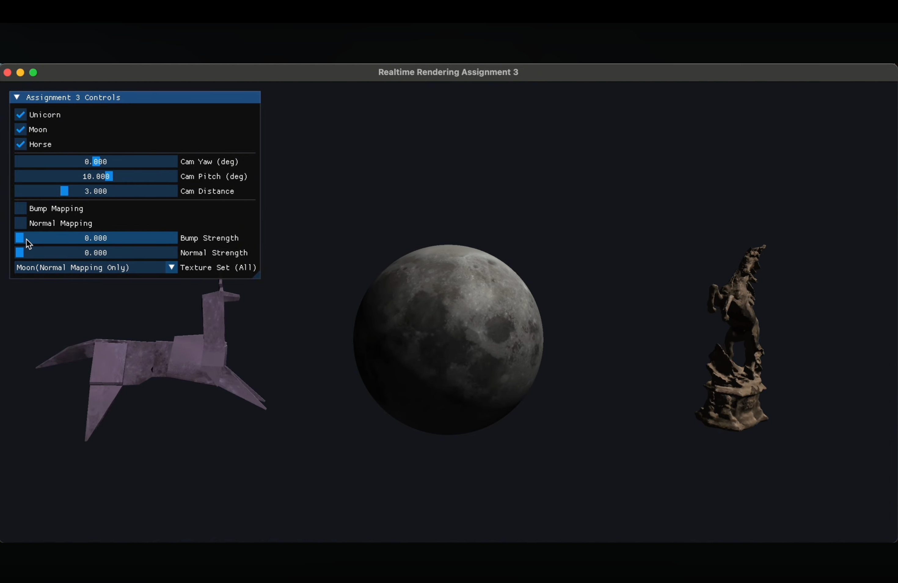
  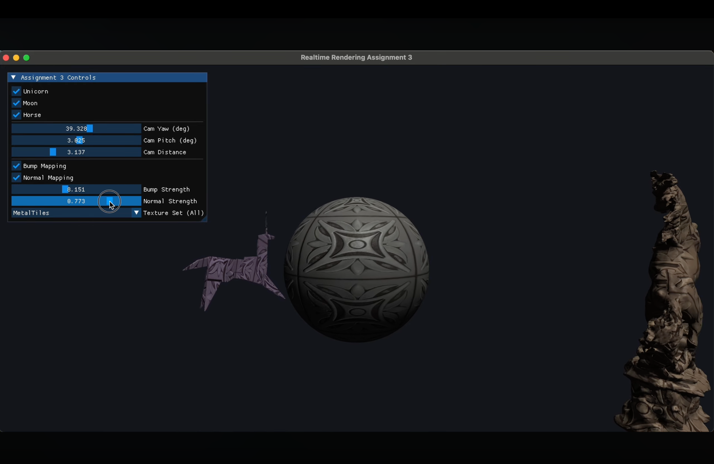
</p>

**Implementation notes**

- **Tangent basis.** Tangents come from Assimp's `aiProcess_CalcTangentSpace`, then on the CPU are Gram-Schmidt orthogonalised against the normal. **Handedness is computed from `sign(dot(cross(N, T), B))` and packed into the tangent's `.w` component** — one float instead of a full bitangent, and it keeps mirrored UV islands from flipping their lighting. The vertex shader rebuilds the bitangent as `B = w · cross(N, T)` and re-orthogonalises after interpolation.
- **Degenerate tangent fallback.** When a mesh carries no tangent data, a seed vector is chosen based on the normal's dominant axis before orthogonalisation, avoiding the zero-length cross product that occurs when the seed happens to be parallel to the normal.
- **Normal mapping** decodes tangent-space normals with `n = texture.rgb * 2 - 1` and blends toward the flat normal by a strength parameter.
- **Bump mapping** derives the normal from a height field at runtime using central differencing over the four texel neighbours, with the texel step recovered from `textureSize()` so the result is resolution-independent: `normalize(vec3(hL - hR, hD - hU, 1))`.
- A 1×1 mid-grey texture stands in for missing height maps, so the bump path yields a zero gradient and disables itself without needing a shader branch.

**What the comparison shows** — a normal map reproduces detail more cheaply (one sample versus four) and more precisely, since it stores direction directly instead of reconstructing it from quantised heights. The height map's advantages are elsewhere: single-channel storage, artist-editable, and it can drive parallax. Neither technique alters the silhouette, which is where both break down at grazing angles.

**Demo:** [YouTube](https://www.youtube.com/watch?v=XG5TZA2C2tw)

---

## Lab 4 — Mipmapping & Texture Filtering

**Branch:** [`Lab_4`](https://github.com/Lara-Tiara/Real-time-Rendering/tree/Lab_4)

A procedural checkerboard on a large floor plane at up to 300× UV tiling — deliberately the worst case for minification aliasing — used to compare all six OpenGL minification filters.

<p align="center">
  
  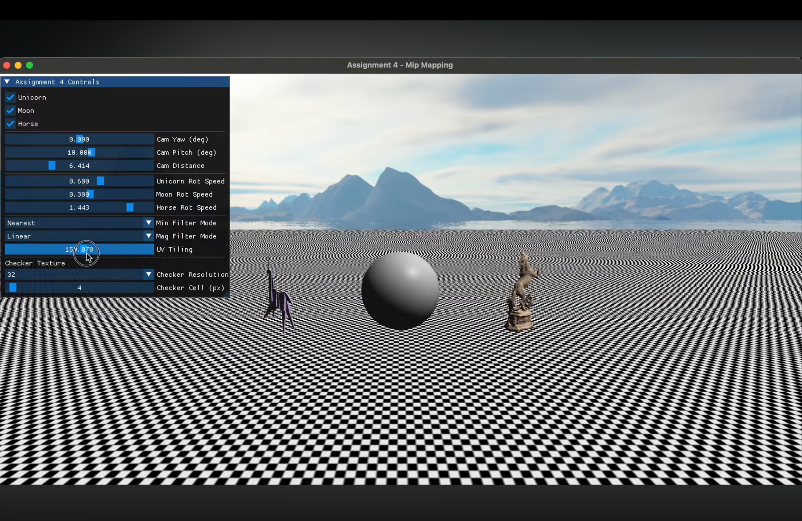
  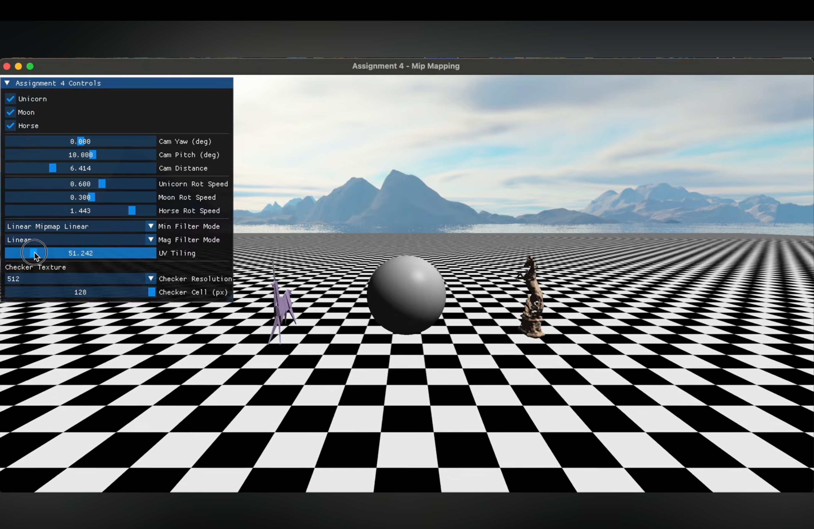
</p>

**Implementation notes**

- Checker texture is generated on the CPU at runtime, with resolution and cell size adjustable, using pure black and white for maximum contrast — the harshest input for the sampler.
- Mip chains built with `glGenerateMipmap`; the six minification filters and two magnification filters are switched live through `glTexParameteri`.
- The scene also carries Assimp-loaded models, Blinn-Phong shading, and a cubemap skybox rendered after opaque geometry with `gl_Position = p.xyww` and `GL_LEQUAL` depth comparison, so early-Z rejects most of its fragments.

**What the experiment shows**

| Filter | Distant floor |
|---|---|
| `GL_NEAREST` | Severe Moiré; strong shimmering under camera motion |
| `GL_LINEAR` | Moiré persists — bilinear filtering does not address undersampling |
| `GL_LINEAR_MIPMAP_NEAREST` | Aliasing resolved, but visible seams where the mip level switches |
| `GL_LINEAR_MIPMAP_LINEAR` | Smooth convergence, but over-blurred at grazing angles |

Three things this makes concrete:

1. **Raising the texture resolution makes distant aliasing worse, not better** — more texels per pixel means more undersampling. Mipmapping works because it pre-filters, not because it adds detail.
2. **Magnification has only two modes for a structural reason.** Magnification is oversampled, so there is no aliasing to suppress and no higher-resolution level to select — the mip chain only descends.
3. **Trilinear filtering over-blurs at grazing angles** because the LOD is chosen from `max(∂uv/∂x, ∂uv/∂y)` — the axis with the fastest change dictates the level for both. This isotropy is precisely what anisotropic filtering exists to fix (not implemented here; see Limitations).

**Demo:** [Youtube](https://www.youtube.com/watch?v=8IHLv64sTFE)

---

## Lab 5 — Anisotropic Cloth Rendering

**Branch:** [`Assignment5`](https://github.com/Lara-Tiara/Real-time-Rendering/tree/Assignment5)

Cloth has directional fibre structure, so its highlights stretch perpendicular to the local weave rather than forming the round lobe of an isotropic material. This viewer drives that behaviour from per-texel fibre orientation.

<p align="center">
  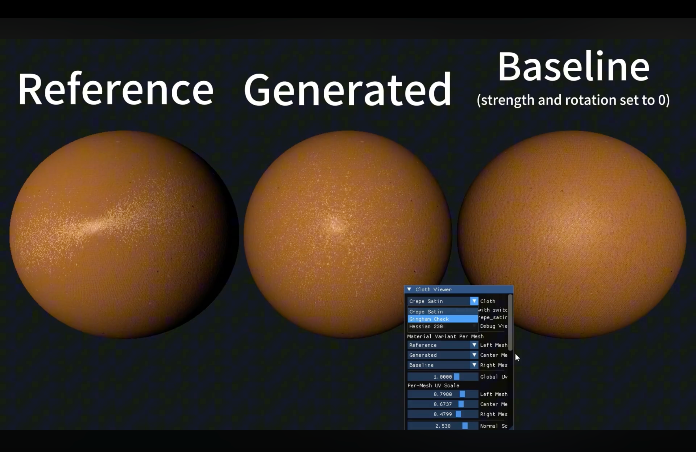
  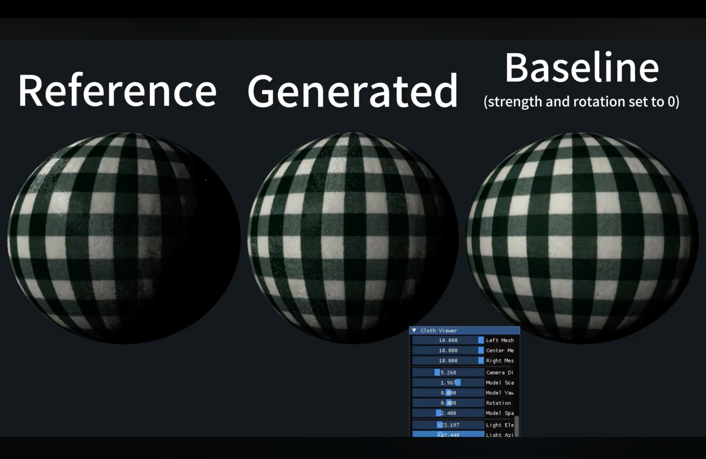
  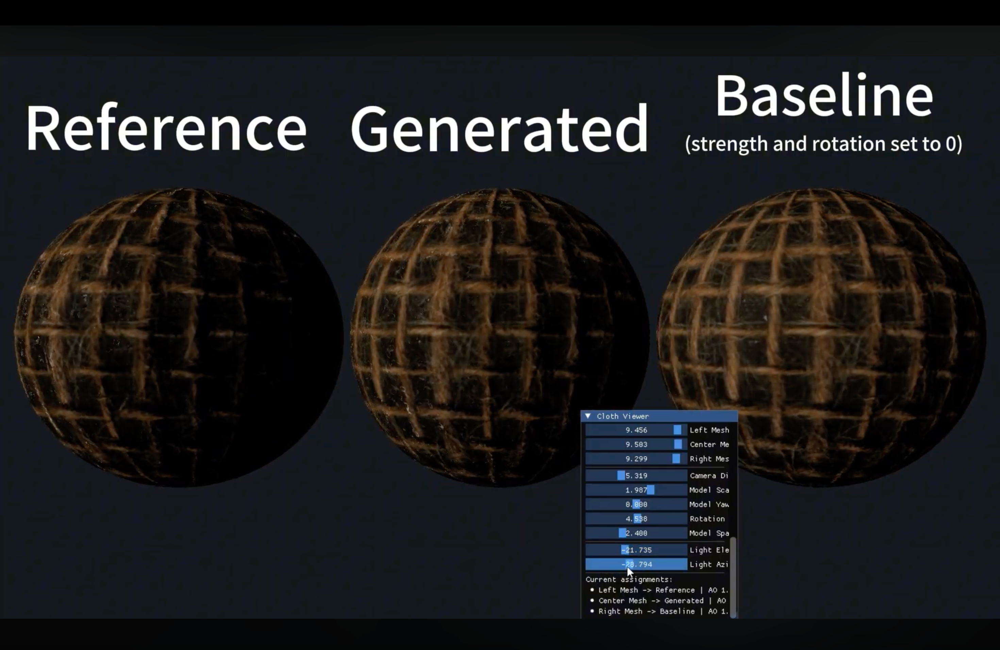
</p>

**Material inputs** — diffuse, roughness, ambient occlusion, normal, **anisotropy rotation** (local fibre direction) and **anisotropy strength** (how directional the response is), at 4K.

**Three-way comparison.** Three identical meshes are rendered side by side with different material variants, which is the point of the viewer rather than an incidental feature:

| Variant | Anisotropy source | Purpose |
|---|---|---|
| **Reference** | Original authored maps | Ground truth |
| **Generated** | Reconstructed rotation/strength maps | The result under evaluation |
| **Baseline** | Anisotropy scale forced to 0 | Isotropic control |

Placing all three under identical lighting and geometry isolates the contribution of the anisotropy maps from every other variable.

**Implementation notes**

- **Colour space is handled per texture, not globally.** Only diffuse is uploaded as sRGB; roughness, AO, normal, and both anisotropy maps are uploaded as linear, since they carry data rather than colour. Treating them all identically is a common source of subtly wrong lighting.
- GPU resources are owned by RAII wrappers (`std::unique_ptr<Texture>`, `Model`, `Shader`), and shaders are loaded from external `.vert` / `.frag` files rather than inlined — a deliberate departure from the single-file structure of the earlier labs.
- Seven debug views expose each material channel individually, which is how the reconstructed maps were checked against the reference.

**What the comparison shows** — the Baseline variant makes the contribution unmistakable: with anisotropy disabled the highlight collapses into a generic isotropic lobe and the fabric reads as plastic. The directional response, not the diffuse texture, is what makes satin look like satin.

**Demo:** [Youtube](https://www.youtube.com/watch?v=-11rdzV9sv4)

---

## Known Limitations

Issues I am aware of and would address next, rather than an exhaustive list of everything unimplemented.

**Correctness**

- **Lab 1** — the Smith geometry term computes `k = (a + 1)²/8` from α = roughness² where the reference formulation uses perceptual roughness. `k` ends up slightly too small at mid roughness, leaving specular marginally brighter than it should be.
- **Lab 1** — Cook-Torrance normalises its diffuse by 1/π while Blinn-Phong and Oren-Nayar do not, so the four models are not on a matched energy scale. For a side-by-side comparison this confounds brightness differences with BRDF differences and should be unified.
- **Colour management is inconsistent across labs.** Labs 1, 2 and 5 apply a correct linear workflow; Labs 3 and 4 do not gamma-encode their output. The right fix is uniform: sRGB internal formats for colour textures, linear for data textures, and `GL_FRAMEBUFFER_SRGB` for output.

**Performance**

- **The normal matrix is computed per vertex** (`transpose(inverse(mat3(uModel)))`) in four of the five labs. It is constant per draw call and should be uploaded as a uniform; in these scenes the transforms are rotation and uniform scale only, so the inverse is not needed at all.
- **Lab 5** loads the same mesh three times instead of sharing one and drawing it with three materials, and reloads all 4K textures when switching cloth presets.

**Scope**

- **Lab 4** does not implement anisotropic filtering, which is the direct answer to the grazing-angle blur the experiment demonstrates.
- **Lab 2** refracts at a single interface; real glass refracts on both entry and exit.
- No shadowing, no image-based lighting, and no deferred path anywhere in the repository — all five labs are forward-rendered with a single analytic light.

---

## Building

Each branch is an independent CMake project.

```bash
git clone https://github.com/Lara-Tiara/Real-time-Rendering.git
cd Real-time-Rendering
git checkout Lab_2          # or main / Lab_3 / Lab_4 / Assignment5

mkdir build && cd build
cmake ..
cmake --build .
```

Dependencies (GLFW, GLAD, GLM, Assimp, Dear ImGui, stb_image) are resolved per branch. `ASSET_DIR` is defined at configure time and points at that branch's asset directory; models and textures are not committed, so paths may need adjusting for a local checkout.
